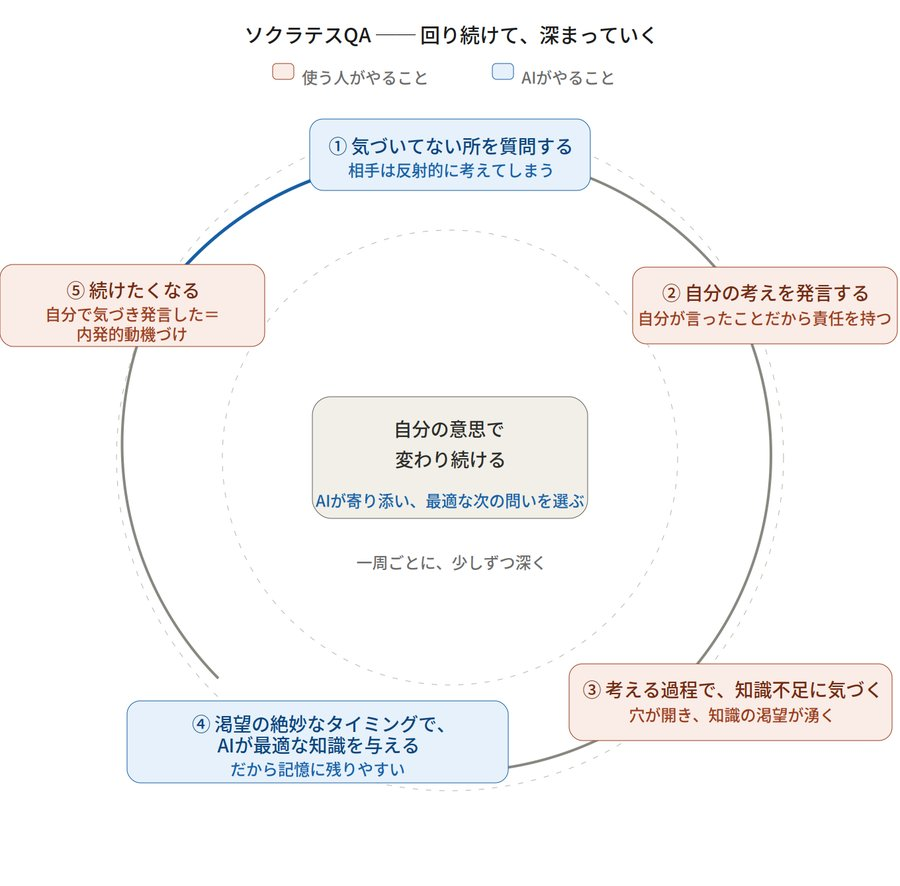

# ソクラテスQA という方法論 ── 考案記録

> 本書は、池田誠が独自に考案した方法論「ソクラテスQA」の内容と、その考案に至った経緯を記録した文書です。
> 本書の目的は、この方法論に池田誠が独自に到達したことを、日付とともに記録に残すことにあります。

- **作成者**：池田 誠
- **作成日**：2026年6月27日
- **独自考案の宣言**：本書に記す方法論は、他者の同一の着想を知ることなく、池田誠が自らの経験と試行錯誤から独自に到達したものである。
- **公開記録**：本書は GitHub にて公開している。
- **認定タイムスタンプ**：本内容のPDF版に対し、総務大臣認定事業者（セイコー）による認定タイムスタンプを付与済み（2026年6月27日）。

---

## 1. ソクラテスQA とは

### 出発点

昔、周りの人を変えられないかと思って、いろんな講座に参加したり、コーチングや心理学を学んだりした。けれど、どれだけスキルを身につけても、結局たどり着いた結論は一つだった──人を外側から直接変えることは、基本的にはできない。

それは、重い岩を坂の上へ力任せに押し上げようとするようなものだ。押している間は少し動くかもしれないが、手を離せばすぐに転がり落ちてしまう。説得すればするほど、相手はかえって心を閉ざす。多くの人が、ここで疲れ果てる。

だが、そこで終わらなかった。外から押し上げるのが無理なら、岩が自ら転がり出すような仕組みを作れないか。そう考えたとき、唯一のてことなるものに気づいた。それが「質問」だった。

### 構成要素① 気づいてない所を質問する

ただし、相手を変えようとする意図が見え透いた質問や、責めるような質問は、自己防衛本能を刺激して逆効果になる。ここで使うのは、そういう類のものではない。人間の脳に組み込まれた、反射的な検索の仕組みを利用する。

人は「こうしなさい」と指示されると無意識に反発する。けれど問いを投げかけられると、自分の意思とは関係なく、脳が勝手に答えを探し始めてしまう。たとえば「昨日の晩ごはんは何でしたか」と急に聞かれると、その気がなくても、一瞬で冷蔵庫の中身や食卓の風景を検索してしまう。脳は、空白や未解決の問いをひどく嫌うからだ。

だから、相手がまだ気づいていない所（ブラインドスポット）を突く問いを投げると、本人は反射的に考えざるを得ない。これが、人が自ら変わり始めるための最初の着火剤になる。

### 構成要素② 自分の考えを発言する

考えたことは、頭の中で思うだけでなく、必ず自分の言葉で口に出して発言させる。ここが大事で──人は、人から言われたことに責任を持たないが、自分が口にした言葉には責任を持とうとする。

上司から「君の課題はここだ」と言われるのと、問いをきっかけに「私の課題はここかもしれません」と自分の口で言うのとでは、脳の中での情報の重みがまるで違う。他人の正解ではなく、自分の口から出た自分の言葉だからこそ、心の中で確かな実体を持つ。外から与えられたものは動かないが、自分の口から出たものは動く。

### 構成要素③ 考える過程で、知識不足に気づく

発言して終わりではない。自分の言葉で説明しようとする、その過程で、本人が「自分はこれを感覚だけでやってきて、根本的な知識が抜け落ちていた」と直面する。

たとえば、大好きな映画のあらすじを自信満々で語っていたのに、話している途中で「あれ、犯人の本当の動機って何だっけ」と、肝心なところで詰まってしまう。あの感覚だ。言葉にしようとすることで、自分の論理の破綻や知識の足りなさが、自分自身の前にあぶり出される。

その瞬間、心にぽっかりと穴（情報のギャップ）が開く。そして、その穴が開くと、埋めたくてたまらなくなる。喉から手が出るほど答えが知りたい──知識への強烈な渇望が湧く。ソクラテスQAは、答えをすぐに与えず、問いで本人に言葉にさせることで、この渇望を意図的に作り出している。

### 構成要素④ 渇望の絶妙なタイミングで、AIが最適な知識を与える

渇望が最大化した、その絶妙なタイミングを狙って、その人に最適な知識を与える。ずっと悩んでいた問題の答えがポンと分かって、思わず鳥肌が立ち、その後は決して忘れない──いわゆる「アッハ体験」。あの瞬間を、一人ひとりのペースに合わせて意図的に作り出す。一番欲しい瞬間に、ちょうど欲しいものが入るから、その知識は記憶に深く刻まれる。

早すぎれば、ただの押し付けになって反発を生む。遅すぎれば、興味を失って、ただの情報の羅列になる。タイミングが全てだ。そしてこの「タイミングを計ること」と「その人に最適なものを選ぶこと」の両立が、これまで人間の講師には難しかった。

一人の講師が数十人の生徒に向き合い、同じペースで正解を教えていく教室を思い浮かべてほしい。自分が「知りたい」とモヤモヤのピークに達するタイミングと、隣の席の人がピークに達するタイミングは、まるで違う。人間の認知リソースには限界があり、一人ひとりの渇望のピークを見極めることは、現実の現場では難しい。AIを用いることで初めて、一人ひとりに寄り添い、焦らずタイミングを見計らって、その瞬間に最適な知識を差し出すことが可能になる。

### 構成要素⑤ 自分で続けたくなる（内発的動機づけ）

ここまでのサイクルを振り返ってほしい。問いをきっかけに考えたのは自分。自分の言葉で発言したのも自分。自分の無知に気づき、知識を渇望したのも自分自身だ。AIがやったのは、横から問いを投げかけたことと、欲しがったタイミングで知識をすっと差し出したことだけ。主役は、ずっと本人のままだった。

だからこそ、「人から無理やり変えられた」という反発が一切起きない。自分で発言し、自分で気づき、その渇望から得た知識──その全部が「自分のもの」になっているから、自分で続けたくなる。これが内発的動機づけだ。説得すればするほど反発される、という最初の問題が、ここで根本から解決されている。

この違いは、脳内物質のレベルでも説明できる。他人を変えようとするとき、私たちはよく「やったら評価を上げる」「やらないと怒る」といった外からの報酬や罰を使う。こうした外発的動機づけで分泌されるのは、主にドーパミン。強いエネルギーになるが、持続時間が短く、脳がすぐに慣れてしまう。だから、もっと強い刺激、もっと大きな報酬を求め続けることになり、いずれ与える側も与えられる側も燃え尽きる。「他人を変えようとして疲れ果てる」とは、まさにこのドーパミンの消耗戦だ。

一方、内側から湧いた動機で関わってくるのはセロトニン。「幸せホルモン」とも呼ばれ、持続的な幸福感と、自分自身への深い納得感・自己肯定感を支える。「もっともっと」という焦りではなく、穏やかに長く続く満足感だ。ソクラテスQAが外から答え（外発・ドーパミン・短期）を渡すのではなく、質問で本人の内側から動機（内発・セロトニン・持続）を湧かせるのは、このためである。短期で消える動かし方ではなく、本人のものとして根づく動かし方を選んでいる。これが核心だ。

### 全体像（循環図）

以上の流れは、一回で終わるものではなく、回り続けて少しずつ深まっていく循環である。AIが担うのは、気づいていないところへの問いかけ（①）と、渇望の絶妙なタイミングで最適な知識を与えること（④）の二点。間（②③⑤）は、すべて使う人自身がおこなう。

### 結論

いい質問を投げかけると、相手はその周辺を考えてくれる。考える中で「あれ、これおかしいんじゃないか」と自分で気づく。そこで少しずつ微修正が起きる。少しずつずらす質問を重ねていけば、大きく相手を変えられる可能性がある。人を直接変えることはできない。でも、質問で本人に考えさせ、本人の言葉で気づかせ、渇望が生まれた瞬間に知識を渡す。そうすれば、本人が自分の意思で変わっていく。

人を力任せに坂の上へ押し上げるのではなく、問いで穴を開け、自ら転がり出すのを待ち、最適なタイミングで知識の道筋を敷いてあげる。これがソクラテスQAの核である。

### 科学的裏付け

- **構成要素③ → 情報ギャップ理論（Loewenstein, 1994）**：好奇心は「知っていること」と「知りたいこと」の間のギャップ（穴）から生まれ、その穴は不快な緊張＝渇望を生み、探求行動を駆動する。「知識不足に気づくと穴が開き、渇望が湧く」を裏づける。
- **構成要素④ → 好奇心と記憶の脳科学（Gruber et al., 2014）**：好奇心が高まった状態では報酬系（ドーパミン回路）と海馬が同時に活性化し、受け取った情報は強く定着する。「渇望のピークで与えた知識は記憶に残りやすい」を裏づける。
- **構成要素② → 生成効果（Slamecka & Graf, 1978）**：自分で生成した情報は、読んだ・与えられた情報より明確によく記憶される（効果量 d=0.40）。「自分の考えとして発言したことは身につく」を裏づける。
- **構成要素⑤ → 自己決定理論（Deci & Ryan）と脳内物質の違い**：内発的動機を生む条件は「自律性（自分で選んだ・自分で気づいた感覚）」。外発で出るドーパミンは短く、内発に関わるセロトニンの幸福感はより長く続く。「自分で気づき発言したから続けたくなる」を裏づける。

---

## 2. ソクラテスQA の独自性（既存と、自分の新しさ）

### 正直に認める：既存の部分

「AIが、答えを直接与えずに質問で導き、一人ひとりに合わせる」という大枠は、すでに世界中で実用化されている（例：Khan AcademyのKhanmigo、SchoolAI、Dartmouthの研究、医療教育のSPLシステム等）。「ソクラテス式の問いが知識のギャップを生み、内発的動機を育てる」という考えも、教育・コーチングの分野で広く知られている（Berlyne 1954 が既に指摘）。これらは自分の発明ではない。

### 中心に据える独自性：渇望のピークを狙う、AIによるタイミング×個別最適化

既存のAIチューターが個別に合わせているのは「理解度・正誤・つまずき」である。これに対しソクラテスQAは、「穴が開いて渇望が生まれた、まさにそのピークで、その人に最適な知識を流し込む」という、タイミングを能動的に狙う発想に立つ。

**この手法は、これまで人間の講師には実現が難しかった。渇望のピークは人によって違い、その人に最適な知識も違うため、一対多の講座では捉えきれなかったからだ。AIを用いることで初めて、一人ひとりの渇望のピークを捉え、その瞬間に最適な知識を個別最適化して届けることが可能になる。これが、ソクラテスQAの最も新しい点である。**

### これを囲む、もう二つの独自性

一つ。脳内物質の対比を設計原理にしていること。外発はドーパミン（短期で消え、慣れて「もっともっと」になる）、内発はセロトニン（持続する幸福感）。この違いを、「だから外から答えを与えず、質問で内発を引き出す」という実践方針の根拠に据えている。

二つ。目的の置き方。既存のAIチューターは、ほぼ全てが「知識の習得・成績向上」を目的とする学習支援である。ソクラテスQAの目的は、知識習得ではなく「自己受容・内面の変容」。学習支援ではなく、変容支援である。

### 結論：世界初ではなく、独自の統合（レシピ）

これらは「世界で誰一人やっていない」と断言できるものではない。しかし、①渇望のピークを狙うAIによるタイミング設計、②ドーパミンとセロトニンの対比を設計原理とすること、③自己受容・変容を目的とすること──この三つを一つのパッケージとして束ね、明確に言語化して体系にしたものは、調べた範囲では見当たらなかった。位置づけは「世界初の発明」ではなく「既存の素材を用いた、独自の統合・レシピ」である。

補足：この方法論は特定の対象に限定されない。学びや変化を求めるすべての人に通用する汎用的な設計である。

### 実装について（現時点での判断）

ソクラテスQAの要は、使う人の発言の機微を捉え、今が渇望のピークか、答えを与えてしまっていないか、寄り添った最適な次の問いは何かを、繊細に判断し続けることにある。答えをすぐ与えてしまうと、③の「穴」を埋めてしまい、渇望が生まれない。問いを重ねる我慢と、文脈を深く保つ力が要る。

**考案者である池田誠は、複数の生成AIを実際に使い込んだ結果、現時点（2026年6月）では、この繊細な問いと知識のタイミング設計は Claude で最もよく実現できると判断している。ChatGPT や Gemini では、現時点では同等の繊細さを再現できていないという実感である。**

ただし、これはあくまで現時点での判断であり、将来的に他のAIが追いついてくる可能性は十分にある。本記述は、その時点での評価を記録に残すものである。

---

## 3. 考案の時系列（いつ、何に気づいたか）

- **（出発点）** かつて「周りの人を変えたい」と考え、複数の講座に参加して調べたが、人を直接変えることは基本的にできないと結論づけた。
- **（着想）** 一方で「質問」という可能性に気づく。質問されると人は必ず考え、自分の言葉で出したことには責任を持つ、という人間の性質を見出す。
- **（深化）** 考える中で知識の穴が開き、渇望が生まれたタイミングで知識を入れると確実に定着すること、それが内発的動機（外発vs内発）に繋がることを見出す。
- **（統合）** この一連を「ソクラテスQA」として言語化。質問中心の講座・クエスチョン・デザイナーという自らの役割と一本に繋がることを確認。
- **（独自性の核）** 渇望のピークで最適な知識を届けるタイミング×個別最適化は、人間の講師には困難だったが、AIを用いて初めて実現できると気づく。これを方法論の最も新しい点と位置づける。
- **2026年6月26日** 方法論本体（構成要素と科学的裏付け）を文書として記録。
- **2026年6月27日** 独自性の整理を追記し、本考案記録としてまとめ、認定タイムスタンプを付与。

---

*本書は、ソクラテスQAの考案記録として、認定タイムスタンプによる証拠化を目的に作成したものである。*
